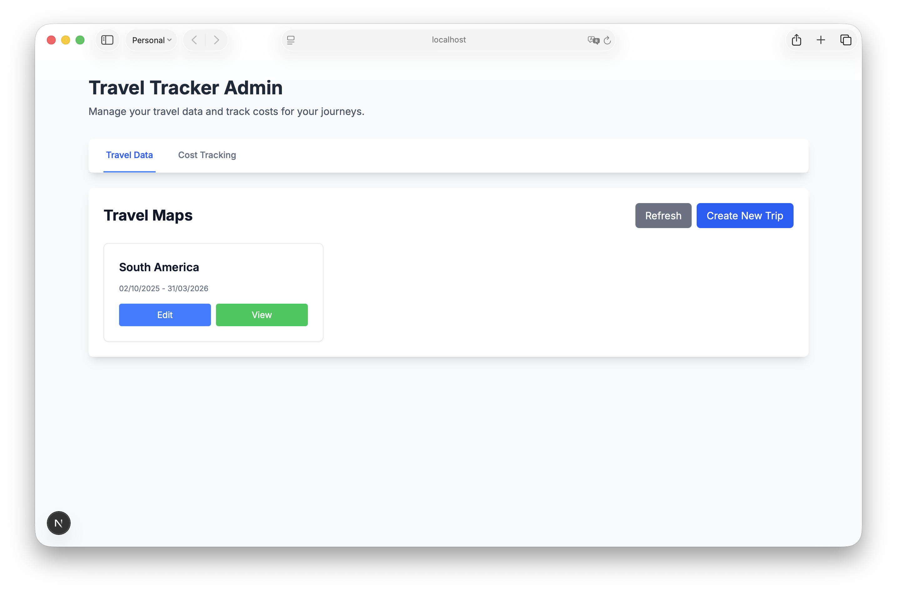
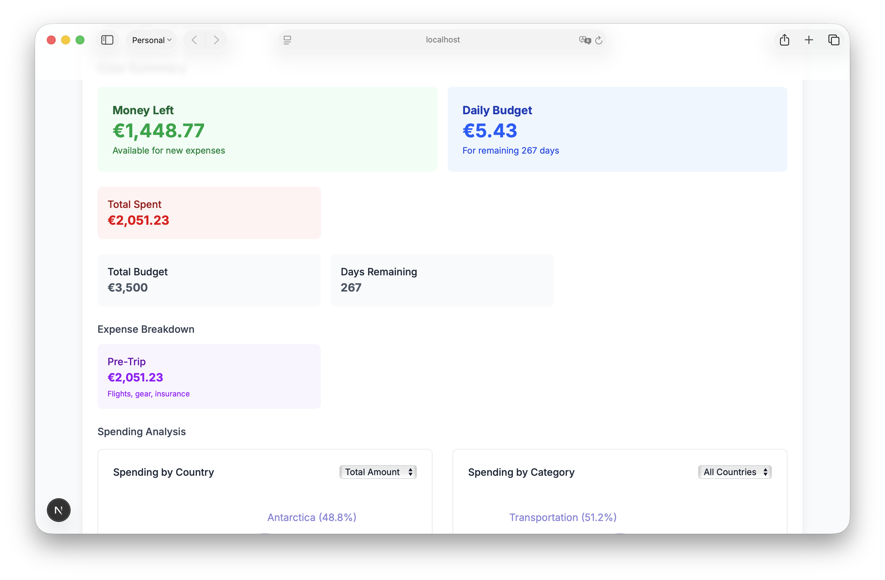

# Travel Tracker


A web application that visualizes travel journeys on an OpenStreetMap (OSM) interface, allowing users to trace their routes through various transportation methods while displaying chronological travel notes, Instagram posts, and blog content alongside the map.



The admin interface provides a comprehensive dashboard for managing your travel data, including trips, cost tracking, and backups.

Furthermore, it includes a private cost tracking feature that allows users to track their expenses and budgets.

## Features

- Interactive OpenStreetMap display with route visualization
- Different route styles based on transportation type (air, land, sea)
- Chronological travel timeline and calendar interface
  
  

  The interactive map view displays your travel routes with location markers, transportation routes, and detailed trip information.

  

  The calendar view provides a chronological overview of your journey, showing locations and activities by date.

  

  The trip editor allows you to add locations, routes, accommodations, and manage all aspects of your travel data.
- Instagram post integration
- Blog post integration
- Comprehensive travel expense tracking and budget management



The cost tracking overview shows your budget status, expenses, and spending summaries at a glance.


The cost tracker editor provides comprehensive tools for managing budgets, expenses, categories, and YNAB integration.

- YNAB (You Need A Budget) integration for importing financial data
- **Backup Management System** with restoration capabilities and automated cleanup
- Responsive design for desktop and mobile
- Server-side data storage

## Technologies Used

- Next.js with TypeScript
- Leaflet.js for map functionality
- Server-side data storage with API endpoints
- Tailwind CSS for styling
- **Bun** as the package manager (fast, modern alternative to npm/yarn)

## Getting Started

### Prerequisites

- Bun (https://bun.sh/) - install with `curl -fsSL https://bun.sh/install | bash`
- Node.js 18.x or later (Bun includes its own Node.js runtime)

### Installation (for local development)

1. Clone the repository:
```bash
git clone https://github.com/bdamokos/travel-tracker.git
cd travel-tracker
```

2. Install dependencies:
```bash
bun install
```

3. Run the development server:
```bash
bun run dev
```

4. Open [http://localhost:3000](http://localhost:3000) in your browser to see the application.

### Installation (for production)

See the [deploy](./deploy) directory for example instructions on how to deploy the application.

## Data Storage

Travel Tracker stores all journey data on the server using API endpoints, ensuring your travel data is safely stored and accessible across devices.

## Backups

- Deleting a trip (admin) creates a JSON backup under `data/backups/` and records it in `data/backup-metadata.json`.
- You can manage/restore backups from the Admin UI (Backups tab).
- Retention/GC defaults: delete backups older than 30 days while keeping at least the newest 20 backups.
  - Configure via env vars: `BACKUP_RETENTION_DAYS`, `BACKUP_GC_KEEP_LATEST`
  - Optional automation token for calling the GC endpoint: `BACKUP_GC_TOKEN`

## Usage

### Journey Management
1. **Creating a Journey**: Click "Create New Journey" to start tracking your travels
2. **Adding Days**: Click "Add New Day" to add a new day to your journey
3. **Adding Locations**: In the edit form, go to the "Locations" tab to add places you've visited
4. **Adding Transportation**: Track how you moved between locations
5. **Adding Instagram Posts**: Link your Instagram posts to specific days in your journey
6. **Adding Blog Posts**: Link your blog posts to specific locations in your journey


### Cost Tracking
11. **Creating a Cost Tracker**: Navigate to the "Cost Tracking" tab in the admin interface
12. **Setting Budget**: Define your overall trip budget and optional country-specific budgets
13. **Adding Expenses**: Record individual expenses with categories, amounts, and locations
14. **YNAB Integration**: Upload YNAB export files to automatically import your financial data, or import them using an API key
15. **Analytics**: View spending breakdowns by country, category, and time period

## Issues
This application is written with my specific needs in mind - feel free to fork it and make it your own and contribute back.

Potential expected issues:
- YNAB export formats may differ based on individual YNAB account settings
- Your currency and default currency may need to be manually changed in the code

---

**Note:** This project uses [Bun](https://bun.sh/) for dependency management and scripts. Bun is much faster than npm/yarn and fully compatible with Next.js projects. Npm should still work.


