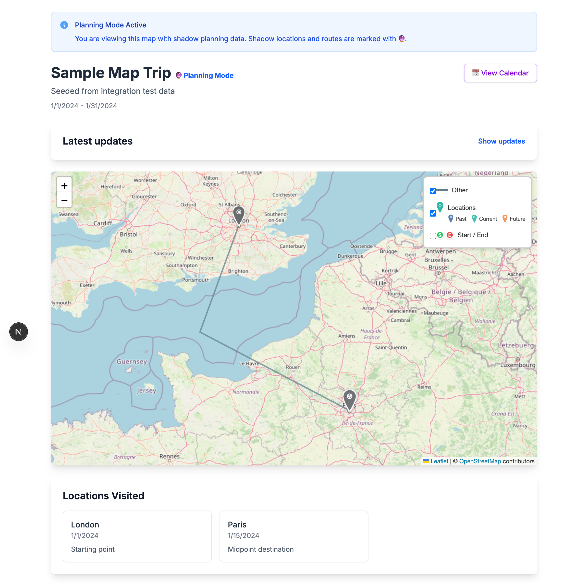
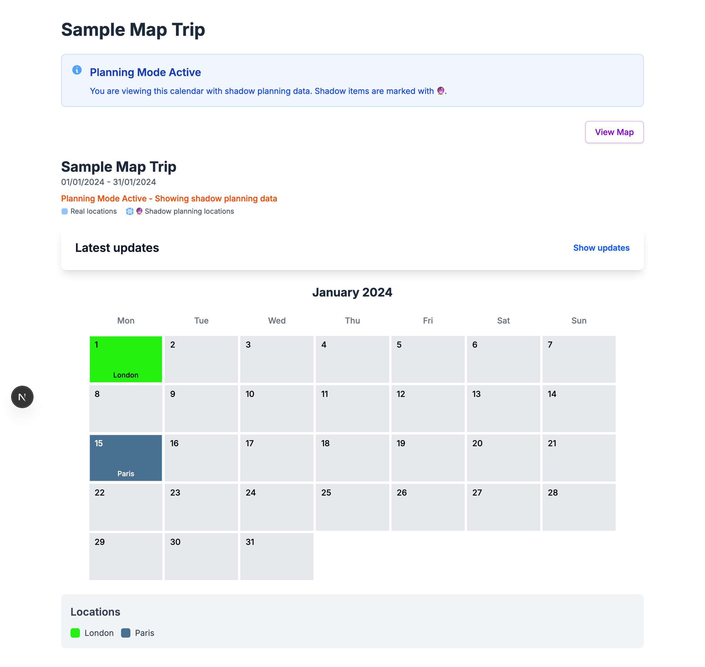
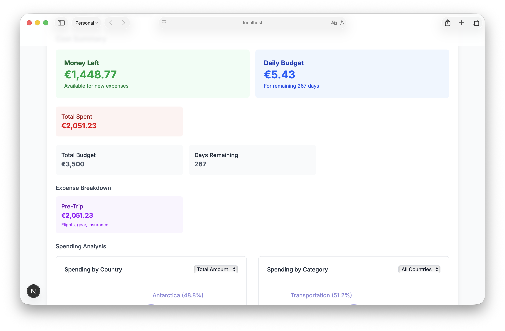

# Sample Map Data Setup

Use the same trip/location/route payloads as the integration test in `src/app/__tests__/integration/map-functionality.test.ts` to seed a server with realistic map data. The workflow mirrors the test pyramid (create trip → add locations → add route points).

## Example Output

After following these steps, you'll have sample data that looks like this:







## Setup Instructions

1. **Start the app** (admin or embed is fine) and export the variables used below:
   - Local dev: `http://localhost:3000`
   - Docker embed service: `http://localhost:3002`
   ```bash
   export BASE_URL="http://localhost:3000"
   export TRIP_ID=""
   export COST_ID=""
   ```
   - Update `BASE_URL` if you are using the docker embed service.

2. **Create a trip:**
   ```bash
   curl -X POST "$BASE_URL/api/travel-data" \
     -H "Content-Type: application/json" \
     -d '{
       "title": "Sample Map Trip",
       "description": "Seeded from integration test data",
       "startDate": "2024-01-01T00:00:00.000Z",
       "endDate": "2024-01-31T00:00:00.000Z",
       "locations": [],
       "routes": []
     }'
   ```
   - Capture the `id` from the response and export it for subsequent calls:
     ```bash
     export TRIP_ID="...response id..."
     ```

3. **Add two locations** (London + Paris) using the same coordinates as the integration test:
   ```bash
   curl -X PUT "$BASE_URL/api/travel-data?id=$TRIP_ID" \
     -H "Content-Type: application/json" \
     -d '{
       "title": "Sample Map Trip",
       "description": "Seeded from integration test data",
       "startDate": "2024-01-01T00:00:00.000Z",
       "endDate": "2024-01-31T00:00:00.000Z",
       "locations": [
         {
           "id": "sample-loc-1",
           "name": "London",
           "coordinates": [51.5074, -0.1278],
           "date": "2024-01-01T00:00:00.000Z",
           "notes": "Starting point"
         },
         {
           "id": "sample-loc-2",
           "name": "Paris",
           "coordinates": [48.8566, 2.3522],
           "date": "2024-01-15T00:00:00.000Z",
           "notes": "Midpoint destination"
         }
       ],
       "routes": []
     }'
   ```

4. **Add a route with route points.** If you don't want to call the external routing API, reuse the mocked route points from the integration tests (a straight line with an intermediate point is enough to render):
   ```bash
   curl -X PUT "$BASE_URL/api/travel-data?id=$TRIP_ID" \
     -H "Content-Type: application/json" \
     -d '{
       "title": "Sample Map Trip",
       "description": "Seeded from integration test data",
       "startDate": "2024-01-01T00:00:00.000Z",
       "endDate": "2024-01-31T00:00:00.000Z",
       "locations": [
         {
           "id": "sample-loc-1",
           "name": "London",
           "coordinates": [51.5074, -0.1278],
           "date": "2024-01-01T00:00:00.000Z",
           "notes": "Starting point"
         },
         {
           "id": "sample-loc-2",
           "name": "Paris",
           "coordinates": [48.8566, 2.3522],
           "date": "2024-01-15T00:00:00.000Z",
           "notes": "Midpoint destination"
         }
       ],
       "routes": [
         {
           "id": "sample-route-1",
           "from": "London",
           "to": "Paris",
           "fromCoords": [51.5074, -0.1278],
           "toCoords": [48.8566, 2.3522],
           "transportType": "train",
           "date": "2024-01-15T00:00:00.000Z",
           "duration": "2h 30min",
           "notes": "Eurostar connection",
           "routePoints": [
             [51.5074, -0.1278],
             [50.0, -1.0],
             [48.8566, 2.3522]
           ]
         }
       ]
     }'
   ```

5. **Confirm the data rendered** by loading the map view for the trip, or fetch it via:
   ```bash
   curl "$BASE_URL/api/travel-data?id=$TRIP_ID"
   ```

6. **Initialize cost tracking data** (based on `src/app/__tests__/integration/cost-tracking-api.integration.test.ts`):
   ```bash
   curl -X POST "$BASE_URL/api/cost-tracking" \
     -H "Content-Type: application/json" \
     -d '{
       "tripId": "'"$TRIP_ID"'",
       "tripTitle": "Sample Map Trip Costs",
       "tripStartDate": "2024-07-01T00:00:00.000Z",
       "tripEndDate": "2024-07-15T00:00:00.000Z",
       "overallBudget": 2500,
       "currency": "EUR",
       "countryBudgets": [
         {
           "id": "budget-france",
           "country": "France",
           "amount": 1200,
           "currency": "EUR",
           "notes": "France portion of trip"
         }
       ],
       "expenses": [
         {
           "id": "expense-test-1",
           "date": "2024-07-02T00:00:00.000Z",
           "amount": 150,
           "currency": "EUR",
           "category": "Accommodation",
           "country": "France",
           "description": "Hotel night 1",
           "expenseType": "actual"
         }
       ]
     }'
   ```
   - Capture the `id` from the response and export it:
     ```bash
     export COST_ID="...response id..."
     ```

7. **Generate additional data by analogy to the integration tests:**
   - Accommodations and linked travel items: see `src/app/__tests__/integration/travel-data-update-links-validation.integration.test.ts` for the payload shape and the `accommodations` array.
   - Social content fields (Instagram/blog posts): see `src/app/__tests__/integration/debug-frontend-flow.integration.test.ts` for `instagramPosts`, `blogPosts`, and `accommodationData` examples in the travel data payload.
   - The same API endpoints (`/api/travel-data` and `/api/cost-tracking`) accept expanded payloads, so you can extend the JSON bodies above with those fields as needed.
